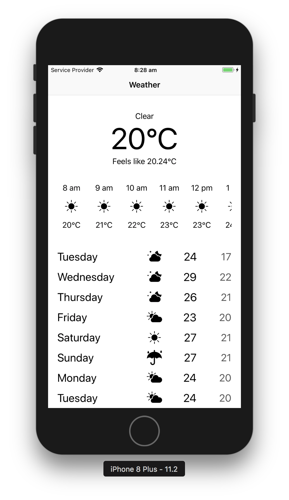

# Weather demo
Using DarkSky API

## Notable features:
 - Written in swift4
 - No third party framework
 - Uses MVVM to cleanly seperate business logic and view logic
 - Use of swift generics and codable protocol to simplify networking stack
 - Mimics iOS weather app UX
 - Unit tests
 - icons from icons8.com

## Things that can be improved
 - More unit tests :)
 - Use of a reactive library can ease the databinding which fits nicely with MVVM pattern
 - more comprehensive error propegation
 - Cell dequeue logic in `ForecastViewController` can be improved

 